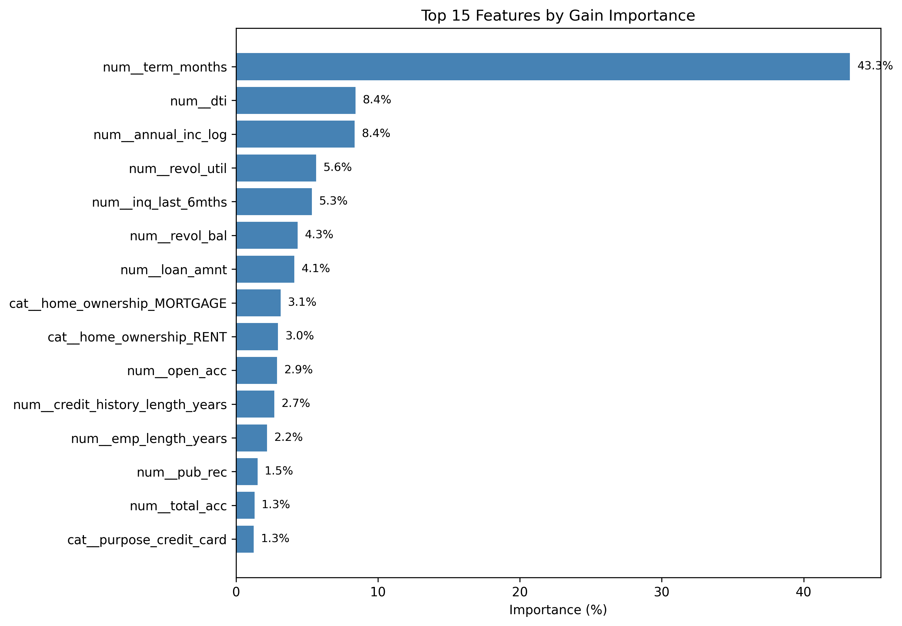

# Credit Default Risk — Model Report

## 1. Final Model

Final model: LightGBM classifier

The model was selected after comparing:

- DummyClassifier
- Logistic Regression
- Balanced Logistic Regression
- Random Forest
- LightGBM
- Balanced LightGBM
- Regularized LightGBM

LightGBM achieved the strongest ROC-AUC and PR-AUC and the lowest estimated business cost under the same manual-review capacity.

## 2. Validation Strategy

A time-based split was used instead of a random split:

- Train: before March 2016
- Validation: March 2016–December 2016
- Test: January 2017–December 2018

This approach better represents production use, where a model is trained on historical data and evaluated on future applications.

## 3. Decision Threshold

The default threshold of 0.5 was not used.

The business policy assumes that the manual-review team can review approximately 20% of applications. The threshold was selected as the 80th percentile of validation-set predicted probabilities.

Final threshold:

`0.2574331565`

Applications with predicted probability above the threshold are sent to manual review. Other applications are approved automatically.

## 4. Business Assumptions

The business-cost calculation uses illustrative assumptions because real Lending Club financial data was unavailable:

- Manual review cost: $100 per application
- Loss from a missed default: 60% of loan amount
- Manual-review effectiveness: 100%

These values are project assumptions and should not be interpreted as actual Lending Club economics.

## 5. Final Performance

|  Metric      | Validation | Test   |
|--------------|-----------:|-------:|
| Accuracy     | 0.7206     | 0.7369 |
| Precision    | 0.4381     | 0.3694 |
| Recall       | 0.3441     | 0.3553 |
| F1           | 0.3854     | 0.3622 |
| ROC-AUC      | 0.6809     | 0.6856 |
| PR-AUC       | 0.4121     | 0.3498 |
| Flagged rate | 20.00%     | 20.23% |

The frozen validation threshold remained operationally stable on the later test period, flagging 20.23% of applications.

Precision and PR-AUC decreased on the test set, while ROC-AUC and recall remained stable. Part of this difference is explained by the lower default rate in the test period.

## 6. Error Analysis

### Loan Term

The model performs very differently across loan terms:

- Recall for 36-month loans: approximately 11.9%
- Recall for 60-month loans: approximately 79.5%

The model identifies defaults much more successfully among 60-month loans, while most defaults among 36-month loans are missed.

### Loan Purpose

Small-business loans have the highest default rate and the strongest recall among purpose groups.

Debt-consolidation loans generate the largest absolute number of false negatives because they represent the largest portfolio segment.

The model struggles more with credit-card, medical, home-improvement and several lower-volume purpose categories.

### Debt-to-Income Ratio

Recall increases strongly with DTI:

- DTI 0–10%: approximately 24.2%
- DTI 30–40%: approximately 50.2%
- DTI above 40%: approximately 74.4%

The model detects high-DTI defaults relatively well but misses many defaults when DTI is low or moderate.

## 7. Feature Importance

Loan term is the dominant feature, contributing approximately 43.3% of total gain importance.

The next strongest features are:

- DTI
- annual income
- revolving utilization
- recent credit inquiries
- revolving balance
- loan amount
- home ownership

The strong importance of loan term agrees with the segment-level error analysis.

Feature importance reflects predictive usefulness, not causal influence.

## 8. Limitations

- Business costs are based on assumptions rather than internal bank data.
- Manual-review capacity was assumed to be 20%.
- The dataset contains historical Lending Club loans and may not represent another lender or current borrowers.
- Model performance varies strongly across loan terms and DTI groups.
- Lender-generated features such as grade and interest rate were excluded from the conservative baseline.
- Probability calibration was not performed.
- Future population and economic conditions may create data drift.

## 9. Future Improvements

- Probability calibration
- Stability analysis across yearly cohorts
- SHAP-based explanations
- More realistic expected-loss assumptions
- Monitoring for feature and prediction drift
- Comparison with an enriched model using lender-generated features
- Segment-specific decision policies